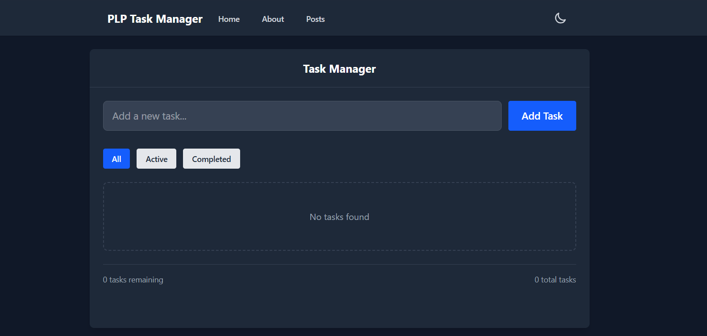
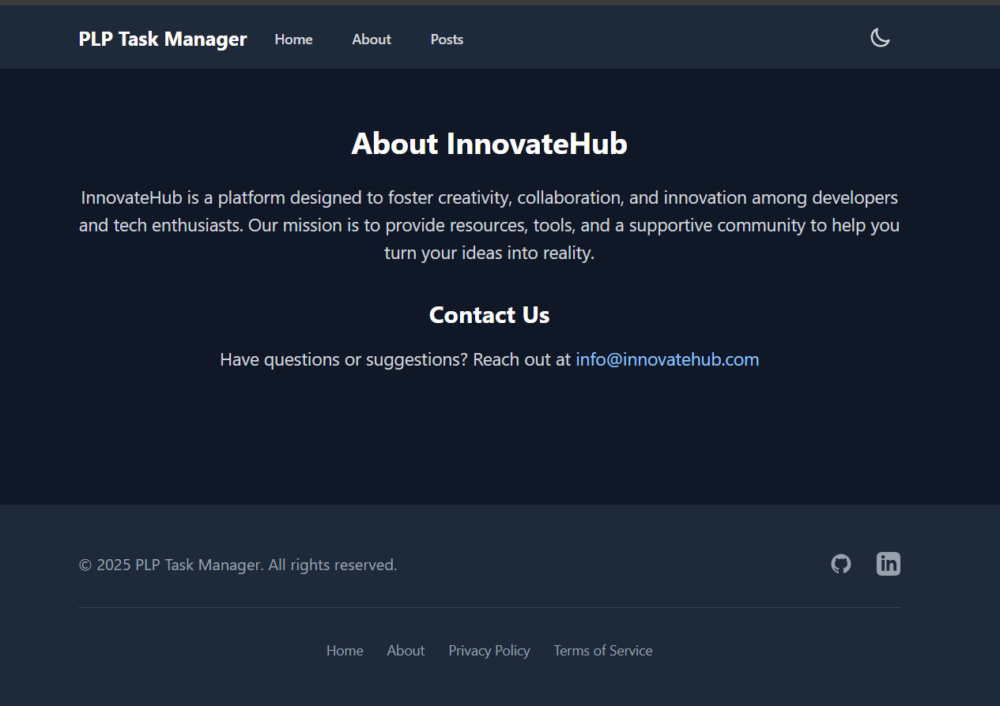
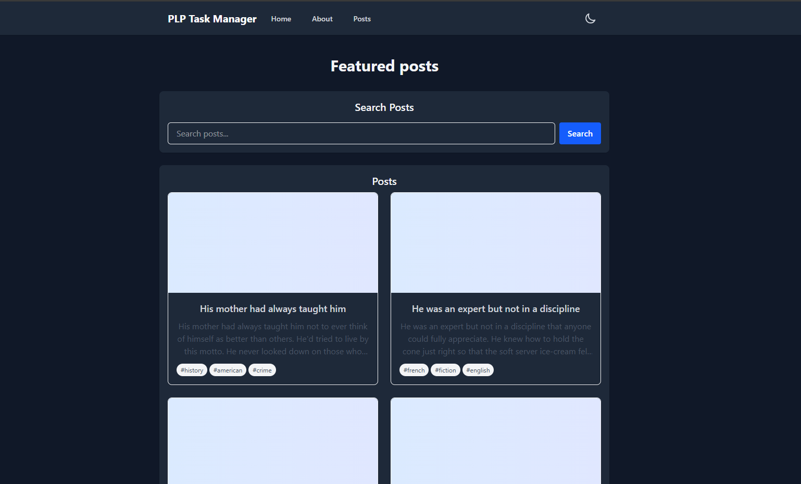

[](https://classroom.github.com/online_ide?assignment_repo_id=19779358&assignment_repo_type=AssignmentRepo)
# React.js and Tailwind CSS Assignment

This assignment focuses on building a responsive React application using JSX and Tailwind CSS, implementing component architecture, state management, hooks, and API integration.

## Screenshots
### Home


### About


### Posts (API) 


## Site link
Below is the link of the site
[InnovateHub](https://week-3-react-js-assignment-wambui-g.vercel.app/)

## Assignment Overview
In this assignment, you will create a React application that demonstrates your understanding of modern web development practices. The focus will be on building a responsive UI using Tailwind CSS, managing state with React hooks, and integrating with external APIs.

## Getting Started

1. Accept the GitHub Classroom assignment invitation
2. Clone your personal repository that was created by GitHub Classroom
3. Install dependencies:
   ```
   npm install
   ```
4. Start the development server:
   ```
   npm run dev
   ```

## Files Included

- `Week3-Assignment.md`: Detailed assignment instructions
- Starter files for your React application:
  - Basic project structure
  - Pre-configured Tailwind CSS
  - Sample component templates

## Requirements

- Node.js (v18 or higher)
- npm or yarn
- Modern web browser
- Code editor (VS Code recommended)

## Project Structure

```
src/
├── components/       # Reusable UI components
├── pages/           # Page components
├── hooks/           # Custom React hooks
├── context/         # React context providers
├── api/             # API integration functions
├── utils/           # Utility functions
└── App.jsx          # Main application component
```

## Submission

Your work will be automatically submitted when you push to your GitHub Classroom repository. Make sure to:

1. Complete all required components and features
2. Implement proper state management with hooks
3. Integrate with at least one external API
4. Style your application with Tailwind CSS
5. Deploy your application and add the URL to your README.md

## Resources

- [React Documentation](https://react.dev/)
- [Tailwind CSS Documentation](https://tailwindcss.com/docs)
- [Vite Documentation](https://vitejs.dev/guide/)
- [React Router Documentation](https://reactrouter.com/) 